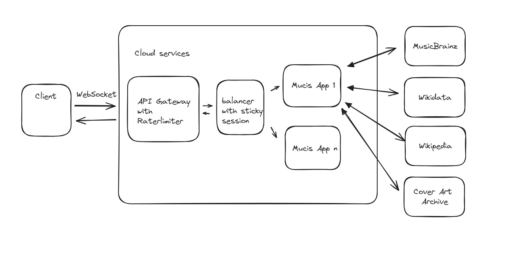
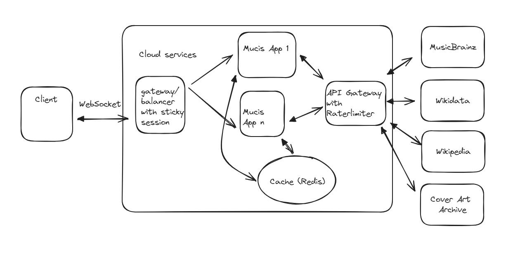

# Artist's information provider by MBID 

## Getting started

The API you create should take an MBID (MusicBrainz Identifier) and return a result containing the following:
- A description of the artist is fetched from MusicBrainz and Wikipedia resources. Wikipedia doesn’t contain any MBIDs so the mapping
between MBID and Wiki can be found in the MusicBrainz API.
- A list of all albums the artist has released and links to its corresponding album cover art. The albums can be found in MusicBrainz, but
the cover art is found in Cover Art Archive.

## Build and Run
1. Build the project
>mvn clean install
2. After build a Docker image will be available in a repository. You can get a lis of images
>docker images 
3. Run the container with command:
>docker run -p 8080:8085 $image_id
4. Rest API will available with address
>http://{host}:8080/api/v1/artists/{mbid}

## Functional requirements in nutshell:
-"Music app" provides informational from different sources, which have different load capacity (request per seconds) or redirects. 
Final response should be combined by several big json responses with strict order.
## How it's implemented
It was implemented as POC.
There is a spring boot application, which uses reactive WebClient to get information from third-party services.
All clients return Mono objects. Reactive objects are able to provide load limitations and async responses, which can be handled, 
transformed, combined and transferred to client.
I had time limits for implementation, so I didn't implement websockets and multi-thread processing, I used just (Mono.defer).
As you can see the response time of the service approximately ~ 3s. It's pretty long for modern system.
The application was covered by several tests.

## How it might be implemented.
## Case 1

We had no requirement to use a cache in our solution. 

## Case 2

If we used a cache in our solution, we would provide for users better response time. 
